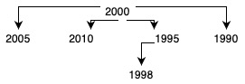

# Indexes

When the database grows, one of the most complicated challenges developers is facing is the performance of the queries. Index is a tool that allows helping with this issue. 

## When indexes are needed.

Let's forget for a second we actually are talking about databases. Consider a library with physical books. Usually, there are thousands of them in one library: they can be stored in different storages and sometimes even in different buildings. It would be very inconvenient if the librarian had to check all the books by every request. That's why every book in the library has a card that stores the main information about this book: the name, the author, the year of publication, and so on. These cards take much less space and can be easily arranged. One book can even have several identical cards if we need to search books, for example, by name and by the year of publication. 

Database indexes is a very similar concept. It's a separate data structure that contains necessary information and the pointer to a record with this information. Similarly to physical indexes, they also require additional space. 


## How indexes work. 

Consider we store a user data in a table called Users: 
| Coulmn name | Type | 
| :-------------: |:-------------:|
| id (primary key) | BIGINT | 
| userName | Varchar | 
| birthYear | Int |

In this table, we have 6 users with the following years of birth: 1990, 1995, 1998, 2000, 2005, 2010

If we create an index for the year of birth, the database creates a data structure called [B-tree](https://en.wikipedia.org/wiki/B-tree). The feature of this structure is that the search of the element in it is very effective. Most of the indexes are stored in this structure, but it depends on the particular database and particular index. 

In our case in the database will be created a structure similar to this one: 



The node which doesn't have any parents called the root node. Any node can have no more than two children. Values of children elements to the right from the parent are higher than the value of parent, and values of children elements to the left are smaller. 

So if we want to find a user with a date of birth 1998, we should first check the root value, 2000 > 1998, which means we should check the right children. Then we compare 1995 < 1998, and it means that we needed left children of the node 1995. And 1998 is a left child of a 1995 node. It means the user with a required year of birth was found.
In our example, we also have a node 1990, and we also could check this node. It's a different strategy and it's also viable. 

But what happens if the new record was added? It has to be inserted somewhere in the B-tree, and the structure of this B-tree might change significantly. In this case creation of the new record in the database will take more time compared to the time required for this operation without indexes. 

## Types of indexes. 

It's possible to create indexes not for one column but for the combination of several. These type of indexes called composite. 

There are generic indexes that can be used for any types of data and queries. But for some use cases, specific types of indexes are created. 

One of these use cases is geometrical objects and geographical data. This type of indexes called spatial index. General-purpose databases like MySQL have some implementation of these indexes, but if the big amount of geometrical or geographical data is going to be stored, special extensions like [PostGIS](https://postgis.net) can be considered. 

The other special use case is a full-text search. It's implemented not in all SQL databases but, for example, PostgreSQL and MySQL have it. Usually, when we need to find a string containing a particular word, we can use LIKE syntax. But this solution is relatively slow. A full-text index database goes through the text field, splits it into words and hash functions are calculated to make the search faster. These indexes in MySQL and PostgreSQL also allowed searching in natural language mode, which searches for the forms of words and synonyms as well.


## How indexes are created. 

For the SQL databases developer can create an index for the column using the following syntax: 

```CREATE INDEX brithYear_asc ON Users(birthYear ASC);```
Indexes can also be on creation on a database: 
```
CREATE TABLE Users (
 id INT PRIMARY KEY,
 userName VARCHAR(50),
 birthYear INT
 INDEX brithYear_asc (birthYear ASC)
);
```

Here brithYear_asc will be the name of the index. 
In this example, we create ascending index but also descending indexes can be used. 

For a composite index creation, commands will be similar: 

```
CREATE INDEX brithYear_name_index ON Users(birthYear ASC, userName DESC);
```
The exact index for a particular database might differ.

These indexes called unclustered. A table can have any amount of unclustered indexes. 

Most of the databases create indexes automatically for primary keys. Such kind of indexes called clustered. Clustered indexes can not only be created automatically but also altered manually. The important fact about the clustering indexes that the table can only have one of those. It means that if another clustered index is required, the previous one has to be deleted. 

# How to understand that index is required. 

Some of the SQL databases like PostgreSQL and MySQL provide tools to measure how much time and resources required for a specific query. To use it the command EXPLAIN has to be used: 

Let's create a table Foo and fill it with some values: 
```
CREATE TABLE Foo (
 id SERIAL PRIMARY KEY,
 column1 VARCHAR(50),
 column2 INT
);

INSERT INTO Foo (column1, column2)
VALUES
 ('value1', 1),
 ('value2', 2),
 ('value3', 3),
 ('value4', 4),
 ('value5', 5),
 ('value6', 6);
```

First, let's look at the result of a generic SELECT query: 
```
test=# EXPLAIN SELECT * FROM FOO;
 QUERY PLAN 
--------------------------------------------------------
 Seq Scan on foo (cost=0.00..15.30 rows=530 width=126)
(1 row)
```
It shows a plan of this query to be executed and costs for a startup, and the full cost. 

Let's look at the difference in the plan for a request filtering on the id field: 

```
test=# EXPLAIN SELECT * FROM FOO where id=1;
 QUERY PLAN 
----------------------------------------------------------------------
 Index Scan using foo_pkey on foo (cost=0.15..8.17 rows=1 width=126)
 Index Cond: (id = 1)
(2 rows)
``` 
and filtering on the column2 filter:

```
test=# EXPLAIN SELECT * FROM FOO where column2=1;
 QUERY PLAN 
------------------------------------------------------
 Seq Scan on foo (cost=0.00..16.62 rows=3 width=126)
 Filter: (column2 = 1)
(2 rows)

```
The cost of the second query is twice higher than the cost of the first query, and it is happening because of the indexes. 
We can have more information about the performance of the query using the syntax EXPLAIN ANALYZE:

```
test=# EXPLAIN ANALYZE SELECT * FROM FOO where column2=1;
 QUERY PLAN 
------------------------------------------------------------------------------------------------
 Seq Scan on foo (cost=0.00..16.62 rows=3 width=126) (actual time=1.427..1.565 rows=1 loops=1)
 Filter: (column2 = 1)
 Rows Removed by Filter: 5
 Planning Time: 1.233 ms
 Execution Time: 3.925 ms
(5 rows)
```

If we see that some queries are executed more often than others or taking a long time, it is useful to check them using EXPLAIN tools and possibly add indexes where needed.
