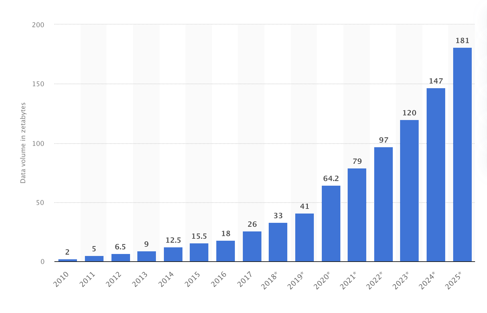
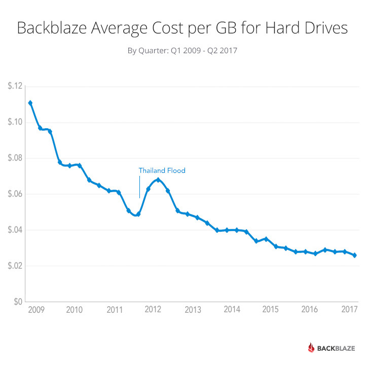

# NoSQL

The idea of storing data in tables is pretty straightforward, but it might not be the most suitable way of storing unstructured data. So for this one and many other use-cases, NoSQL databases are often used. 

## What is a NoSQL database?

The first time the title "NoSQL" was introduced by Carlo Strozzi in his [Strozzi NoSQL](http://www.strozzi.it/cgi-bin/CSA/tw7/I/en_US/NoSQL/Home%20Page) database. This database was relational but didn't use SQL for its queries. 

Nowadays, "NoSQL" is used as an umbrella term for many databases, usually non-relational. "NoSQL" stands for "Non-SQL" or "Not only SQL". The main difference from SQL-like databases is that NoSQL databases don't store the data in relational tables. 

## Which kinds of NoSQL databases exist? 

NoSQL database is a vast name, and it doesn't say anything about how exactly this database works. But at the moment, there are four the most popular types of NoSQL databases: 
* Key-value stores: these databases map key to a value. This database implements a data structure similar to a Map in Java or Dictionary in Python. They are usually used to store information that needs quick access, for example, cache. Examples: Redis, DynamoDB;
* Wide-column stores: these databases use tables and rows as relational databases. But the difference is that the format and names of columns might change from row to row in the wide-column store. They might be treated as two-dimensional key-value stores and are usually used for storing versatile objects. Examples: BigTable, ApacheHBase;
* Document databases: originally were created to store documents in XML format. But nowadays, they can work with different formats of data such as JSON, YAML, BSON and others;
* Graph databases: databases that operate with nodes and edges (relationships). They are used to represent data where the most important part is relationships between objects. Graph databases are very useful in identifying patterns in semi-structured and not structured data. Examples: InfiniteGraph, Neo4j;

More about these types of databases you can read in prerequisites articles. 

## Why NoSQL database became popular?

With time the amount of data that needs to be stored increased drastically. For example, according to [the research](https://www.statista.com/statistics/871513/worldwide-data-created/) in ten years (2010 - 2020) the amount of data worldwide increased in 32 times. 

At the same time cost of the storage decreased: 

[source](https://www.backblaze.com/blog/hard-drive-cost-per-gigabyte/)

With the increasing amount of data and becoming less structured, it became more difficult to create schemas to store this data in relational databases. Thereby NoSQL databases became more and more popular in a modern development world. 

## BASE principles

NoSQL databases became popular in conditions of continuously increasing amounts of data. They had to offer simpler horizontal scalability (the system should be able to handle bigger loads only with adding new machines). Usually, NoSQL databases don't offer consistency between the instances of the database, but instead, they offer eventual consistency. It means that eventually, the data stored on every instance of the machine will be the same. The time needed for a database to become consistent is usually expressed in milliseconds. 

In general, NoSQL databases follow BASE principles: Basically Available, Soft state and Eventual consistency. The Basically available principle means that the database is available at all times. The soft state means that the state of the system can change even without input data, for example, for making the system consistent. 

## When to use NoSQL databases? 

NoSQL databases were created when relational databases became too complicated. And this is still the biggest reason to use a NoSQL database. If the project needs to operate with semi-structured or not structured data, NoSQL will be a good choice. 
 
Alongside it, using of NoSQL database can have other benefits. For example, some NoSQL databases were designed to handle big data, and they have all kinds of optimizations helping to make the work with it more effective. 

Development time usually is lower for the NoSQL databases. In the modern world, it might also be an important point to consider. 

## When not to use NoSQL databases?

NoSQL databases, in general, doesn't offer consistency and sometimes it might be very important, for example, in applications that handle bank transactions. 

The other questionable moment is the query language. If lots of complicated queries, including joins, are required, usually NoSQL databases are not a good choice because the query interface is quite limited. This is changing over time, and query interfaces are becoming more sophisticated, but at the moment, relational databases are still much better with it.

NoSQL databases are more agile than relational databases, and because of it, they have become very popular. They allow developers to work easily with unstructured data and offer eventual consistency. 